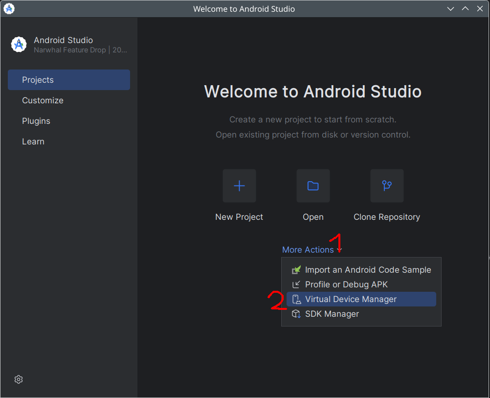
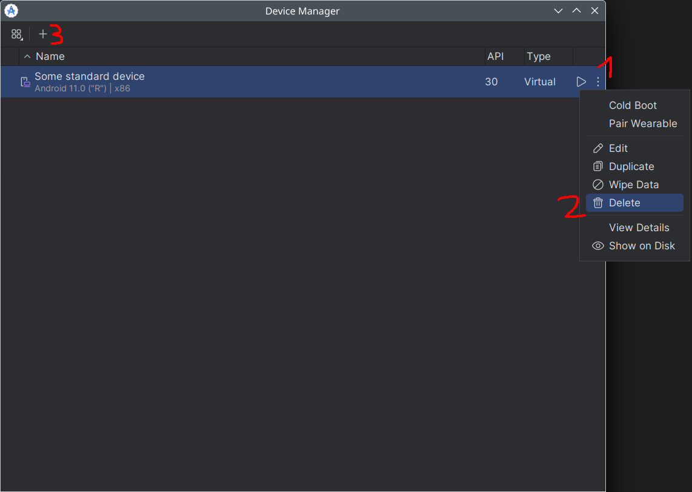
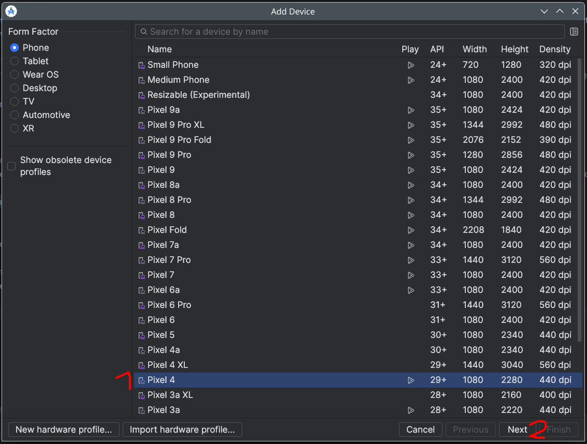
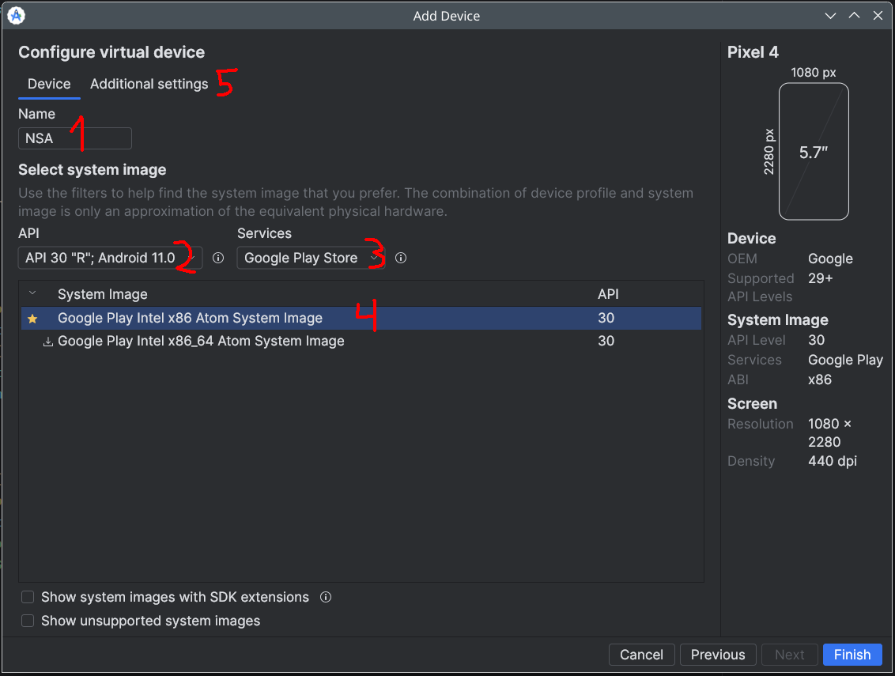
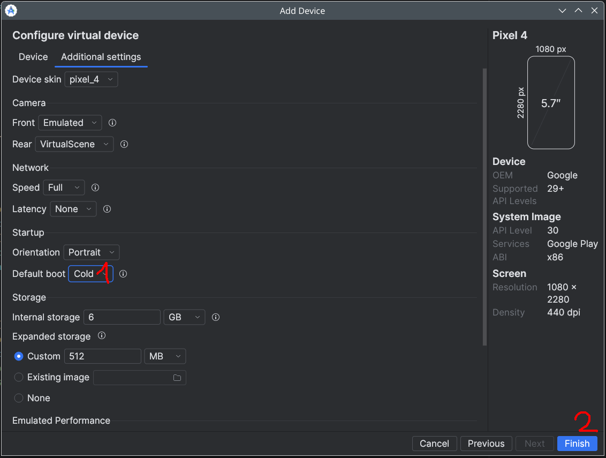
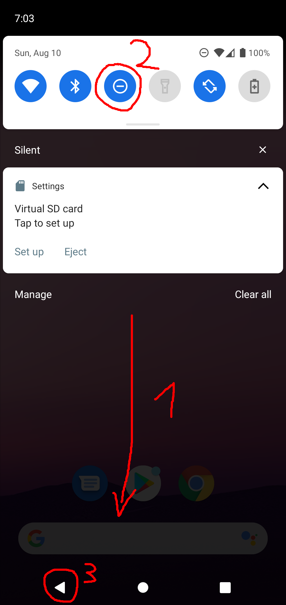
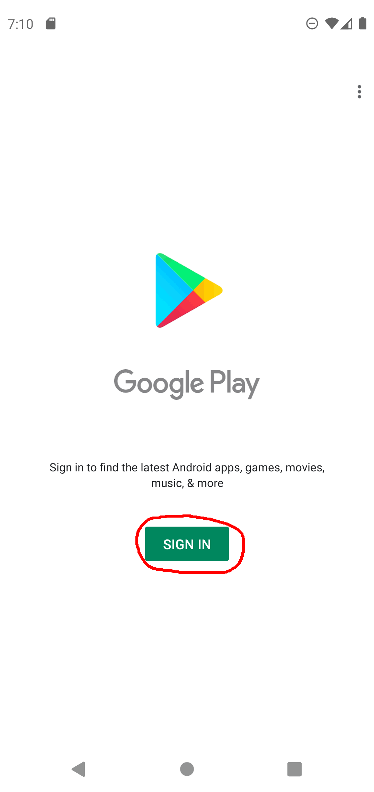
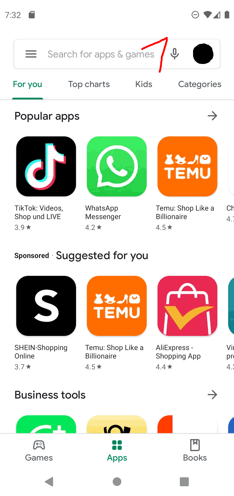
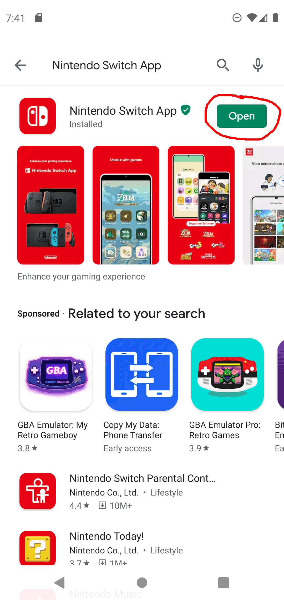
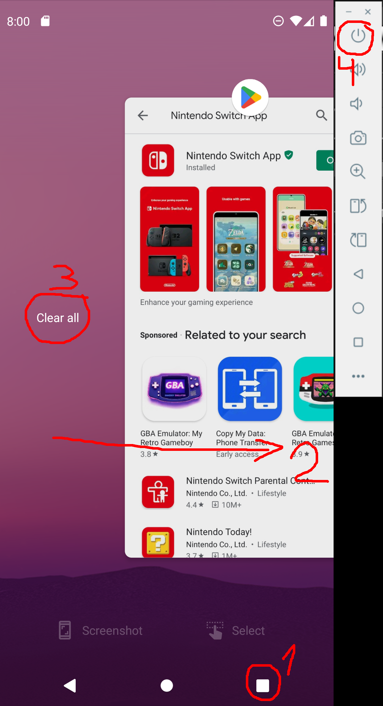

# s3s quickstart tutorial - instructions on how to set up s3s + stu to use Lean's Gear Seed Checker or stat.ink export

This file contains instructions on how to set up [s3s by frozenpandaman](https://github.com/frozenpandaman/s3s) in combination with SplatNet3 Token Util (stu) to either generate a seed file for [Lean's Gear Seed Checker](https://leanny.github.io/splat3seedchecker/#/) or to use it to upload your battles to [stat.ink](https://stat.ink). For this to work, you will need s3s, stu and an Android Emulator set up in a specific way. This emulator will have the Nintendo Switch App installed which will be used to get the tokens necessary to use s3s.

The emulator used in this tutorial will be a Pixel 4 with Android API 30 (= Android 11) and Play Store activated. All relevant files will be found in various `pixel_4_api_30_play_store` subfolders throughout the project.

You can also watch a [video tutorial](https://www.youtube.com/playlist?list=PLm5B9FzOsaWeRbzPTuyTZ3qK2f2GibFP_) walking through the steps of this tutorial but keep in mind that this file is the "truth". Whenever the video tutorial and this file are different, this file with be correct and the video tutorial will be wrong/outdated.

## Prerequisites
Please ensure you have these applications installed on your computer:
- Android Studio
- git
- python in version 3.11 or higher
- pip - this usually is a part of python
- cURL
- additional software required by s3s. As of now (August 2025), s3s does not need any additional software to run.

If you are unsure on how to install the software listed here, usually a quick internet search similar to `Windows install Android Studio` will help. Of course, replace `Windows` with your operating system and `Android Studio` with the software you want to install.

**IMPORTANT NOTE**: Android Studio does not run on ARM computers, which means very small computers like the Raspberry Pi are currently **not** supported by this project! It might be possible to run splatnet3-token-util with a different emulator on ARM computers as long as this emulator supports ADB and is bootable using the command line. The community would need to find a way to do that, I will not provide support for these kind of scenarios. If you find a way, feel free to open an issue or a Pull Request!  
Alternatively, you can use an x64 Mini PC. I use a Beelink S12 Pro with Fedora Linux for this project. These computers are slightly more expensive than a Raspberry Pi but work quite well.

## Clone the projects
I recommend using a distinct directory on your computer and add both the s3s and stu directories in that folder. If you already have downloaded s3s, you can use this version and don't need to download s3s again. However, this tutorial requires s3s to be at least at version `0.7.0` or newer. If your version of s3s is older, please update it to at least `0.7.0`.

### Clone STU
Open a Terminal/Command line and head to the directory you wish to download stu to and run this command:
```shell
git clone git@github.com:strohitv/splatnet3-token-util.git
```

### Clone s3s
If you need to download s3s as well, run this command, too:
```shell
git clone git@github.com:frozenpandaman/s3s.git
```

### Use already downloaded version of s3s
If you want to use an already downloaded version of s3s, make sure to refresh s3s to have at least version `0.7.0`:
```shell
cd Path/To/s3s
git pull
```

## Install Python requirements
The next step is to download and install python requirements. This is very easy and can be done using pip:
```shell
cd Path/To/STU
pip install -r requirements.txt

cd Path/To/s3s
pip install -r requirements.txt
```

## Create an Android Emulator (= Android Virtual Device, AVD)


Please open Android Studio next. In the main menu, navigate like this:
1. Click on "More Actions"
2. Select "Virtual Device Manager"

This will bring you into the Virtual Device Manager, a menu where you can manage Android Virtual Devices (AVD => that's the "emulated phone"). 

### Remove default device and enter creation dialog
After installation, Android Studio will create a default Android Emulator which we don't need because the token extraction won't work with it. For this reason, we will delete it and create a working AVD instead.


1. Click on the three dots at the entry for the wrong device
2. Select "Delete" and delete the AVD
3. Click on the Plus sign at the top of the window to open the menu for creating a new AVD.

**IMPORTANT NOTE**: Do not rename AVDs ever! This will lead to errors which can be fixed but are annoying to deal with.

### Select the phone type

1. In the list of devices, select the __Pixel 4__. **IMPORTANT**: select only Pixel 4, NOT "Pixel 4 XL" or "Pixel 4a".
2. Afterward, click on "Next".

### Base settings
In the next screen, change the settings according to the ones shown in this image:


1. Give the Device a good and short name you can remember. I always use `NSA` (short for Nintendo Switch App). I recommend using only uppercase + lowercase letters from a-z and numbers, NO spaces or special characters.
2. Select `API 30 "R"; Android 11.0` in the drop-down list.
3. Ensure the Services are set to `Google Play Store`
4. Select `Google Play Intel x86 Atom System Image` in the list of possible System Images.
5. Go to the additional settings tab.

### Additional settings
In the Additional settings tab, there is only one setting to be changed:


1. Set the Default boot method to `Cold Boot`.
2. Afterward, finish setting up the new Android Device by clicking on the `Finish` button.

The Device will now be created and after a short while, it will be shown in the Device Manager tab in Android Studio.

From this step on, we don't need Android Studio anymore. Keep in installed on your computer but **close it and never boot the Android Emulator through it!**

## Configure STU
Open a command line terminal in the SplatNet3-token-util folder and run these two commands:
```shell
python main.py
python run_s3s.py
```

When ran in a freshly downloaded directory, these commands will generate a few config files and exit afterward without doing something else.

### Configure token extraction

We are interested in the `./config/config.json` file which contains the main configuration for the token extraction. Open it with a text editor (for example: Notepad++).
1. You don't need to change a setting under the `token_config` and `run_config` sections.
2. On the `emulator_config` section, make sure that `avd_name` is set to the name you gave the AVD when you set it up earlier. If you have installed Android Studio into the default directories, everything else should be correct.

**IMPORTANT FOR WINDOWS USERS**: if you need to edit file paths, make sure to use double backslashes `\\` instead of single backslashes `\` in all `.json` files, for example: `C:\\Users\\someone` instead of `C:\Users\someone`.

### Copy Pixel 4 files
From the folder `./script-examples/config/pixel_4_api_30_playstore`, copy both `boot.txt` and `cleanup.txt` into the `./config` directory. You can override the existing `boot.txt` and `cleanup.txt` files, they only contain dummy text.

### Configure s3s integration
There are two files we need to edit to set up the s3s integration:

First, open the `./config/template.txt` file. Here, you need to set either one or two options, depending on if you only use Lean's Gear Seed Checker tool or also stat.ink.
1. Set your language and region properly using the `acc_loc` setting. The format is `language|region`, for example `en-US|US` is US-American English and someone living in the US. Similar, `de-DE|AT` would be "German German" and someone living in Austria.
2. **If you ONLY want to use Lean's Gear Seed Checker**: Enter `skip` into the `api_key` field.
3. **If you (also) want to upload battles to stat.ink**: Enter your stat.ink api key into the `api_key` field. You can get the api key from your [stat.ink profile page](https://stat.ink/profile), it is the field called "API Token".
4. **Always do this**: Copy the `template.txt` file into the s3s directory and rename it to `config.txt`. Otherwise, it will ask you for settings you've already entered into the `template.txt` file.

The other file which needs to be edited is the `./config_run_s3s.json` file. In this file, one setting must be changed and the others might need to be changed.
1. Insert the location of the s3s directory into the `s3s_directory` config.
2. If the `python_command` is wrong, change it to the correct command. Usually it's either `python` or `python3`.
3. If the `git_command` is wrong, change it to the correct command.
4. If the `pip_command` is wrong, change it to the correct command. Usually, it's one of the following: `pip`, `pip3`, `python -m pip` or `python3 -m pip3`.

Point 3. and 4. are only relevant if you set one of the update settings from `false` to `true`.

With this, both STU and s3s are ready. The last remaining thing is to set up the emulator to be used for token extraction.

## Configure AVD and install NSO
To boot the emulator, open a command line terminal and head into the `splatnet3-token-util` directory. Afterward, run this command:
```shell
python main.py --emu
```

It will boot the emulator and after a short while, you will be in the Android main menu.

### Activate Do Not Disturb
During token extraction, the AVD will be controlled automatically. This control could be disturbed by notifications popping up. These notifications can be hidden by activating Do Not Disturb.



1. Swipe down to open the control menu for Android.
2. Click on Do Not Disturb to activate the feature.
3. Press the back button to return to the main menu.

### Open Play Store and log in with your Google Account
Please open the Google Play Store by clicking on the Play Store app icon and login using your Google account credentials.



1. Click on `SIGN IN`
2. Enter your mail address and click on `NEXT`
3. Enter your password (you can use the computer keyboard) and click on `NEXT`
4. Solve the 2-Step-Verification if you have it activated for your account
5. Click on `I agree`
6. Disable the toggle for `Use basic device backup` and click on `MORE` and `ACCEPT` afterward

### Install Nintendo Switch App
You are now in the Play Store main menu and can install the Nintendo Switch App.



1. Tap on the search bar
2. Enter `Nintendo Switch App` into the search bar.
3. Press the search button on the virtual keyboard
4. Click on `INSTALL` to install the Nintendo Switch App
5. Wait until the installation is successful

### Sign in to your Nintendo Account
The last thing you need to do to finish Android Emulator setup is to sign in to your Nintendo Account.



1. Tap on `Open` to open the NSA app
2. Tap on `Sign In`
3. Disable `Usage Statistics` in Chrome and tap on `Accept & continue`
4. Tap on `No thanks`
5. Enter E-Mail address, Password and tap on `Sign in`
6. Go through the 2-Factor-Authentication if it's enabled for your account
7. Select the correct NSA account and tap `Choose this person`
8. Tap on `Next` five times
9. Tap on `Don't Allow`


### Close apps and shutdown emulator
With this, everything is successfully set up, and we can do the first run of s3s + stu next. But first, we need to shut the emulator down real quick.



1. Press the task manager button in the bottom right corner
2. Swipe from the left to the right until the `Clear all` button is visible
3. Press the `Clear all` button to close all apps
4. Do a long press onto the power button besides the emulator window and press `Power off` once the power menu appears.

Congratulations! Everything is ready now.

## Use the app
Open a command line terminal and head into the `splatnet3-token-util` directory.

To use the automatic token refresh whenever s3s does not find valid tokens, simply use the `run_s3s.py` script instead of the actual `s3s.py` one. `run_s3s.py` is a wrapper script, this means it will always support exactly the same arguments `s3s.py` supports.

For example, you can do this:
```shell
# print all available commands
python run_s3s.py --help

# Lean's Gear Seed Checker
# export a gear file which you can upload to Lean's Gear Seed Checker
# IMPORTANT: please read next section if --getseed fails
python run_s3s.py --getseed

# stat.ink export
# upload recent battles to stat.ink
python run_s3s.py -r 

# upload recent battles to stat.ink and activate monitoring mode
python run_s3s.py -r -M
```

## workaround for the `--getseed` bug
As of now, there is a bug that `--getseed` in s3s will **never** work while the tokens are not valid. This also applies to the automatic token refresh using the integration with splatnet3-token-util. I sent frozenpandaman a bugfix but as of now (August 13th 2025), it is not yet integrated into s3s. You can monitor the status of [PR 215](https://github.com/frozenpandaman/s3s/pull/215) to find out whether the bug still applies (PR is marked as `Open`) or if s3s got fixed (PR is marked as `Merged`). Once it's `Merged`, please refresh s3s to make `python run_s3s.py --getseed` work without any further issues.

Luckily, there is a workaround which allows us to still use `--getseed`:
```shell
# refresh tokens if required
# DO THIS COMMAND AS LONG AS PR 215 IS OPEN
python run_s3s.py -r -t 

# after the command has succeeded, your tokens will be valid (nothing else has happened)
# you can now run the --getseed command successfully
python run_s3s.py --getseed
```
